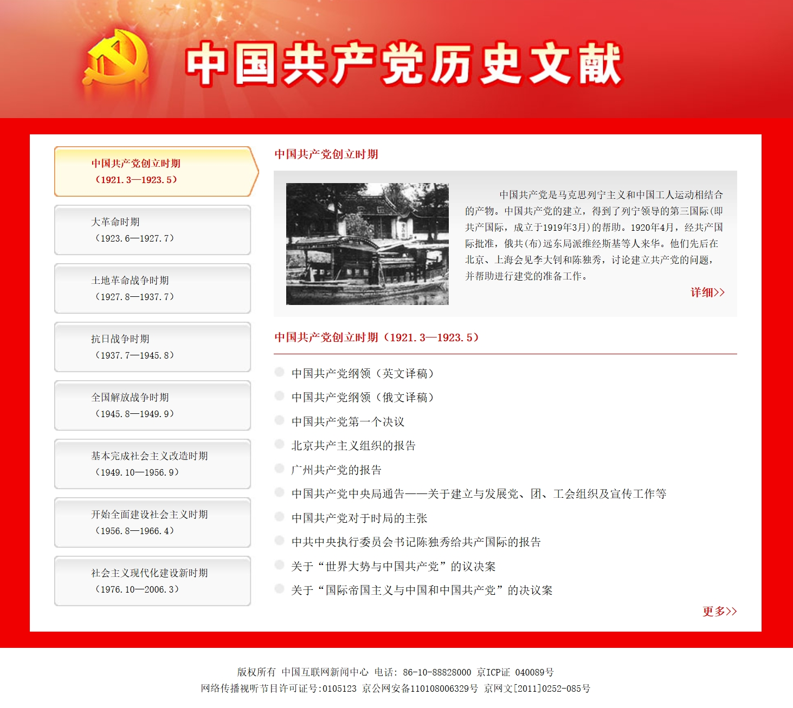

# 首页

## 说明

本站的目录以及文档来源于[中国网：中国共产党历史文献](https://web.archive.org/web/20160516210108/http://www.china.com.cn/guoqing/node_7168949.htm)，但是由于网页年久失修，内容时效，所以我出于个人兴趣，根据残存的目录补全了这个网站。

*图：原网站备份截图*

由于WayBack Machine爬虫的局限性，有些目录和文本内容丢失了。笔者很想自己去各处搜集补全文本，但因个人精力有限，未能实现。且中共中央大多文件汇编只有pdf扫描本，将其文本光学识别成可编辑字符也十分费力。

如果各位有兴趣协助补充、完善本站，可联系站长。

## 致谢

在补全的过程中，以下工具或网站给了本站极大的支持，特此鸣谢：

- [中国网]()：本站的资料来源
- [Wayback Machine]()：伟大的网页时光机！因为它保存了原网站的目录，才有了今天这个复活版网站。
- Docute：本站所用的建站程序
- Cursor：节省了大量的代码撰写工作时间，让我能专心的整理文章
- [Jina.AI](https://r.jina.ai/)：帮助我节省了大量处理html复杂排版的时间
- [中文马克思主义文库](https://www.marxists.org/)：给本人搜集资料提供了极大的便利。
- [Google]()：世界上最伟大的搜索引擎！
- Markdown：世界上最优雅的文本排版语言
- [Clash Verge]()：没有它我怎么使用世界上最伟大的网站们！

## 致恨

<del>病魔什么时候战胜方滨兴啊！</del>

## 参见

对于寻找共运其它资料，亦可参见以下网站，资料较为齐全：

- [中文马克思主义文库](https://www.marxists.org/chinese/pdf/marxism-library.htm)