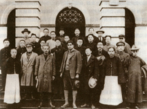

# 大革命时期(1923.6—1927.7)

>
> 
>
> 第一次大革命时期也称第一次国内革命战争时期。1923年6月，中国共产党第三次全国代表大会在广州召开。出席大会的代表有陈独秀、李大钊、蔡和森、张国焘、毛泽东等30多人，代表全国420名党员。中共中央也从上海迁到广州。大会正确地估计了孙中山的革命立场和国民党进行改组的可能性，决定共产党员以个人身份加入国民党，用这种形式实现国共合作。
>
>[【更多】](./introduce.md)

- [共产党在国民党内的工作问题议决案](./article-1.md)
- [中国共产党第三次对于时局宣言](./article-2.md)
- [中国共产党对于时局之主张](./article-3.md)
- [对于出席共产国际第五次大会代表报告之议决案](./article-4.md)
- [中国共产党第二次修正章程](./article-5.md)
- [中国共产党第四次全国大会宣言](./article-6.md)
- [中国共产党给第二次全国劳动大会的信](./article-7.md)
- [全国被压迫阶级在中国共产党旗帜底下联合起来呵！](./article-8.md)
- [中华全国总工会对国民政府出师宣言](./article-9.md)
- [论国民政府之北伐](./article-10.md)
- [陈独秀给各级党部的信——对于扩大党的组织的提议](./article-11.md)
- [共产国际执行委员会第七次扩大全体会议关于中国问题决议案](./article-12.md)
- [中国共产党致中国国民党书——为肃清军阀势力及团结革命势力问题](./article-13.md)
- [中国共产党为蒋介石屠杀革命民众宣言](./article-14.md)
- [中国共产党接受《共产国际执行委员会第七次扩大全体会议关于中国问题决议案》之决议](./article-15.md)
- [政治形势与党的任务议决案](./article-16.md)
- [中国共产党第五次全国代表大会宣言](./article-17.md)
- [中国共产党第五次全国代表大会为"五一"节纪念告世界无产阶级书](./article-18.md)
- [中国共产党第五次全国代表大会为"五一"节纪念告中国民众书](./article-19.md)
- [关于小资产阶级问题共产党与国民党的关系](./article-20.md)
- [工人政治行动议决案](./article-21.md)
- [中国共产党第三次修正章程决案](./article-22.md)
- [中国共产党告全国农民群众](./article-23.md)
- [中国共产党致中国国民党书——关于政局的公开信](./article-24.md)
- [中国共产党致第四次全国劳动大会的信](./article-25.md)
- [中国共产党中央委员会对政局宣言](./article-26.md)
- [国民革命的目前行动政纲草案](./article-27.md)
- ["八七"中央紧急会议](./article-28.md)
- [中国共产党中央执行委员会告全党党员书中国共产党全体党员鉴](./article-29.md)
- [党的组织问题议决案](./article-30.md)
- [中国共产党的政治任务与策略的议决案](./article-31.md)
- [中国共产党为辛亥革命纪念告民众书](./article-32.md)
- [中央临时政治局扩大会议中国现状与党的任务决议案](./article-33.md)
- [政治纪律决议案](./article-34.md)
- [关于第六次全党代表大会之决议](./article-35.md)
- [关于土地问题党纲草案的决议](./article-36.md)
- [中国共产党为广东工农兵暴动建立苏维埃告民众](./article-37.md)
- [中国共产党为广州暴动再告全国民众](./article-38.md)
- [湖南农民运动考察报告](./article-39.md)
- [迅速出师讨伐蒋介石](./article-40.md)
- [共产国际执行委员会关于中国革命目前形势的决定](./article-41.md)