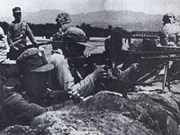

# 抗日战争时期(1937.7—1945.8)

>
> 
>
> 二十世纪三十年代，第一次世界大战后走上法西斯主义道路的德、意、日三国企图重新瓜分世界，先后结为反共同盟，成为欧洲和亚洲的战争策源地。经过长期的准备，日本帝国主义于1937年7月公然发动大规模的全面侵华战争。7月7日夜，日本侵略军在北平西南的卢沟桥附近，突然向中国驻军进攻，中国官兵奋起抵抗。中华民族全面抗战从此开始。
> 
> [【更多】](./introduce.md)

- [中国共产党中央委员会为纪念抗战五周年宣言](./article-1.md)
- [中国共产党为日军进攻卢沟桥通电](./article-2.md)
- [红军将领为日寇进攻华北致蒋委员长电](./article-3.md)
- [中央关于组织抗日统一战线扩大救亡运动给各地党部的指示](./article-4.md)
- [中央关于目前形势的指示](./article-5.md)
- [中央关于同国民党谈判的十项条件给朱德周恩来叶剑英的指示](./article-6.md)
- [中国共产党抗日救国十大纲领 ——为动员一切力量争取抗战胜利而斗争](./article-7.md)
- [中央革命军事委员会关于红军改编为国民革命军第八路军的命令](./article-8.md)
- [关于对待托陈派分子的原则的指示](./article-9.md)
- [关于国共两党抗日民族统一战线建成后宣传内容的指示](./article-10.md)
- [中央关于开展全国救亡运动的指示草案](./article-11.md)

**说明：**从此以后的文件网上只有扫描版，作者精力有限，无力整理，故只放标题。

- [中央政治局关于准备召集党第七次全国代表大会的决议](./article-12.md)
- [中国共产党对时局宣言 ——巩固国共两党精诚团结，贯澈抗战到底，争取最后胜利](./article-13.md)
- [三月政治局会议的总结目前抗战形势与如何继续抗战和争取抗战胜利](./article-14.md)
- [中央关于中共十七周年纪念宣传纲要](./article-15.md)
- [中共中央为抗战一周年给蒋委员长及全国抗战将士电](./article-16.md)
- [论新阶段抗日民族战争与抗日民族统一战线发展的新阶段——一九三八年十月十二日至十四日在中共扩大的六中全会的报告](./article-17.md)
- [关于抗日民族统一战线的与党的组织问题](./article-18.md)
- [毛泽东在延安反侵略大会上的演词](./article-19.md)
- [毛泽东在纪念孙中山先生逝世十三周年及追悼抗敌阵亡将士大会上的演说词](./article-20.md)
- [共产国际的决定与声明](./article-21.md)
- [中央关于汪精卫出走后时局的指示](./article-22.md)
- [中央关于拒绝所谓一个大党问题给周恩来的指示](./article-23.md)
- [中央关于我党对国民党防共限共对策的指示](./article-24.md)
- [中共中央为国共关系问题致蒋介石电](./article-25.md)
- [中国共产党中央委员会为开展国民精神总动员运动告全党同志书](./article-26.md)
- [中国共产党中央委员会为抗战两周年纪念对时局宣言](./article-27.md)
- [中央关于反对东方慕尼黑阴谋的指示](./article-28.md)
- [中国共产党中央委员会电悼白求恩大夫](./article-29.md)
- [毛泽东、王稼祥关于晋西南事件与我们方针的补充指示](./article-30.md)
- [中央对新四军发展方针的指示](./article-31.md)
- [中央关于与国民党谈判条件不能让步问题给南方局的指示](./article-32.md)
- [中共中央关于目前时局与党的任务的决定](./article-33.md)
- [参政员毛泽东等为"华北视察团"事致国民参政会电](./article-34.md)
- [毛泽东、王稼祥关于争取对内和平、巩固已得阵地的方针与具体步骤给彭德怀电](./article-35.md)
- [中央关于争取小党派及中间分子的指示](./article-36.md)
- [中国共产党中央委员会为抗战三周年纪念对时局宣言](./article-37.md)
- [中央关于开展统一战线工作的指示](./article-38.md)
- [毛泽东、朱德、王稼祥关于新四军行动方针的指示](./article-39.md)
- [毛泽东关于目前时局的指示](./article-40.md)
- [毛泽东关于不反对蒋加入英美集团及制止投降分裂致周恩来电](./article-41.md)
- [毛泽东关于动员党内外一切力量制止剿共绎日的指示](./article-42.md)
- [中央关于反对投降挽救时局的指示](./article-43.md)
- [八路军将领致林主席蒋委员长等电](./article-44.md)
- [朱德、彭德怀等关于百团大战的预备命令](./article-45.md)
- [朱德、彭德怀等关于百团大战的行动命令](./article-46.md)
- [纠正统一战线中的"左"右倾错误](./article-47.md)
- [朱德、彭德怀等关于调整百团大战作战部署的指示](./article-48.md)
- [全国同胞起来制止当前时局的严重危机](./article-49.md)
- [百团大战光辉战绩](./article-50.md)
- [关于蒋介石政治动向的估计](./article-51.md)
- [关于在国共关系僵局中对国民党的策略的指示](./article-52.md)
- [共产党七参政员致国民参政会公函](./article-53.md)
- [关于皖南事变后我军军事方针的指示](./article-54.md)
- [共产党七参政员为重申不能出席本届会议理由复参政会函](./article-55.md)
- [中国共产党对苏日中立条约发表意见](./article-56.md)
- [中央宣传部关于展开对国民党宣传战的指示](./article-57.md)
- [中央关于出版《解放日报》等问题的通知](./article-58.md)
- [中央关于统一各根据地内对外宣传的指示](./article-59.md)

**说明：**由于WayBack Machine的爬虫问题，这一页的文件本来应该有2页，但它只爬取了第一页的文献列表，所以这里也只列举第一页。我会把原网站的存档链接和可能可以找到其它文献的参考链接放在这里，如果需要可以参考。

本部分内容大部分收录在以下文献中：

- [《中共中央文件选集》（1921年—1949年9月）](https://www.marxists.org/chinese/reference-books/ccp-1921-1949/index.htm)
- [《中国共产党抗日文件选编》](../../books/book-1.md)