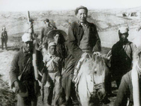

# 全国解放战争时期(1945.9—1949.10)

>
> 
>
> 抗战胜利后，中国人民迫切需要一个和平安定的环境，休养生息，重建家园。为了争取中国走向光明的前途，中国共产党领导广大人民经过3年多的人民解放战争，推翻了国民党反动统治，解放了除台湾等岛屿外的全国领土。
> 
>  [【更多】](./introduce.md)

- [毛泽东关于抗战胜利后的方针给饶漱石等的指示](./article-1.md)
- [中央书记处关于和国民党谈判情况的通知](./article-2.md)
- [中共赴渝谈判代表团关于目前的宣传方针问题致中央电](./article-3.md)
- [中央关于采取强硬态度拒绝美军登陆的指示](./article-4.md)
- [中央关于双十协定后我党任务与方针的指示](./article-5.md)
- [中央关于过渡时期的形势和任务的指示](./article-6.md)
- [中央关于对国民党军队进行宣传攻势的指示](./article-7.md)
- [中央关于抓紧进行减租运动和生产运动的指示](./article-8.md)
- [朱德关于中国共产党对美军在华行动的态度问题答外国记者](./article-9.md)
- [中央宣传部关于广播、报纸宣传方法问题给各中央局各区党委电](./article-10.md)

**说明：**从此以后的文件网上只有扫描版，作者精力有限，无力整理，故只放标题。

- [中央、军委关于粉碎国民党军大规模军事进攻的指示](./article-11.md)
- [新华社记者评蒋介石在宪政实施协进会上的演讲](./article-12.md)
- [庆祝欧洲反法西斯战争胜利结束](./article-13.md)
- [新华社评论国民党第六次全国代表大会](./article-14.md)
- [庆祝抗战最后胜利](./article-15.md)
- [纪念孙先生"和平、奋斗、救中国！"](./article-16.md)
- [真和平与假和平](./article-17.md)
- [反对内战，反对武装干涉](./article-18.md)
- [中共中央关于停止国内军事冲突的通告](./article-19.md)
- [中央关于遵照停战命令停止进攻坚守阵地的指示](./article-20.md)
- [中央关于执行停战命令的指示](./article-21.md)
- [中央宣传部关于停战后的宣传方针的通知](./article-22.md)
- [和平建国纲领草案](./article-23.md)
- [中央关于争取蒋介石国民党向民主方面转变暂时停止宣传攻势的指示](./article-24.md)
- [中央宣传部关于广播、报纸宣传方针的通知](./article-25.md)
- [中央关于坚决反对国民党反动派破坏政协决议的指示](./article-26.md)
- [中央关于谈判重点及对国民党与美国的态度问题给周恩来的指示](./article-27.md)
- [中央关于目前解放区土地改革宣传方针的指示](./article-28.md)
- [毛泽东主席关于反对美国军事援蒋法案的声明](./article-29.md)
- [中央关于全面破裂后作战方案给刘伯承等的指示](./article-30.md)
- [中央关于当前形势问题给林彪的指示](./article-31.md)
- [中央关于发表纪念"七七"宣言后对美国及国民党斗争问题的指示](./article-32.md)
- [中国共产党中央委员会为纪念"七七"九周年宣言](./article-33.md)
- [中央关于马歇尔、司徒雷登发表公报后我党对策问题给周恩来的指示](./article-34.md)
- [中央关于开展美军退出中国运动周的指示](./article-35.md)
- [中共代表团致蒋介石马歇尔备忘录](./article-36.md)
- [中共中央发言人廖承志关于揭穿蒋介石继续大打阴谋的声明](./article-37.md)
- [新年祝词](./article-38.md)
- [中共中央宣传部部长陆定一关于蒋方"和平方案"全系骗局的声明](./article-39.md)
- [中共中央关于不承认蒋政府一切卖国协定的声明](./article-40.md)
- [中共中央负责人关于蒋介石强迫京、沪、渝中共代表撤退的声明](./article-41.md)
- [周恩来关于四国外长会议检讨中国问题的声明](./article-42.md)
- [中央革命军事委员会主席毛泽东关于保卫延安的命令](./article-43.md)
- [中共中央为纪念"七七"抗战发布对时局口号](./article-44.md)
- [毛泽东关于第一年作战总结及今后计划给林彪等的指示](./article-45.md)
- [中央关于克服一切困难争取整个军事形势转变的指示](./article-46.md)
- [毛泽东关于第二年的战略方针及华野西兵团的任务给陈毅、粟裕的指示](./article-47.md)
- [驳蒋介石](./article-48.md)
- [中国共产党与中国——纪念中国共产党成立二十五周年](./article-49.md)
- [蒋军必败](./article-50.md)
- [全力准备大反攻——纪念"五一"节](./article-51.md)
- [努力奋斗迎接胜利——纪念中国共产党创立二十六周年](./article-52.md)
- [总动员与总崩溃](./article-53.md)
- [人民解放军二十周年](./article-54.md)
- [人民解放军大举反攻](./article-55.md)
- [星星之火可以燎原——纪念十月革命三十周年](./article-56.md)
- [中央关于对中间派和中产阶级右翼分子政策的指示](./article-57.md)
- [刘少奇关于土改整党建设乡政权问题致薄一波等](./article-58.md)
- [中央关于对待在华外国人的政策的指示](./article-59.md)

**说明：**由于WayBack Machine的爬虫问题，这一页的文件本来应该有2页，但它只爬取了第一页的文献列表，所以这里也只列举第一页。我会把原网站的存档链接和可能可以找到其它文献的参考链接放在这里，如果需要可以参考。

本部分内容大部分收录在以下文献中：

- [《建党以来- 重要文献选编- (一九二一→ 一九四九)》](https://www.marxists.org/chinese/pdf/ccp/3/22.pdf)
