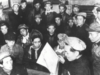

# 基本完成社会主义改造时期(1949.10—1956.9)

>
> 
>
> 随着国民经济的恢复，1953年冬，中共中央提出了党在过渡时期的总路线。即“从中华人民共和国成立到社会主义改造完成，这是一个过渡时期。党在这个过渡时期的总路线和总任务，是要在一个相当长的时期内，逐步实现国家的社会主义工业化，并逐步实现国家对农业、手工业和资本主义工商业的社会主义改造”。
> 
> [【更多】](./introduce.md)

- [人民政协共同纲领草案的特点](./article-1.md)
- [中华人民共和国中央人民政府公告](./article-2.md)
- [中国人民解放军总部命令](./article-3.md)
- [中共中央关于少数民族"自决权"问题给二野前委的指示](./article-4.md)
- [新华总社关于土改后农村阶级划分问题给东北总分社的复电](./article-5.md)
- [关于学习松江县召开各界人民代表会议经验的指示](./article-6.md)
- [毛泽东批转薄一波《关于华北各城市召开各界代表会议的情形和经验的报告》](./article-7.md)
- [关于大量吸收和培养少数民族干部的指示](./article-8.md)
- [中华全国总工会关于劳资关系暂行处理办法](./article-9.md)
- [中共中央批准华中局《关于纠正乡村工作干部不良作风的决定》的指示](./article-10.md)

**说明：**从此以后的文件网上只有扫描版，作者精力有限，无力整理，故只放标题。

- [发行公债弥补财政赤字](./article-11.md)
- [关于一九五○年度全国财政收支概算草案的报告](./article-12.md)
- [中央人民政府委员会关于发行人民胜利折实公债的决定](./article-13.md)
- [中共中央关于中央人民政府成立后党的文化教育工作问题的指示](./article-14.md)
- [中央人民政府人民革命军事委员会关于-九五○年军队参加生产建设工作的指示](./article-15.md)
- [当前财经形势和新中国经济的几种关系](./article-16.md)
- [在第一次全国教育工作会议上的总结报告要点](./article-17.md)
- [毛泽东关于周恩来去苏联参加谈判问题给中共中央的电报](./article-18.md)
- [关于中苏两国在新疆设立金属和石油公司的问题给毛泽东的报告](./article-19.md)
- [政务院关于关税政策和海关工作的决定](./article-20.md)
- [中共中央宣传部关于"人民民主专政实质上就是工农民主专政"给三野政治部的指示](./article-21.md)
- [中共中央关于讨论和执行人民日报《学会管理企业》的社论的指示](./article-22.md)
- [中苏两国关于缔结友好同盟互助条约及协定的公告](./article-23.md)
- [政务院关于严禁鸦片烟毒的通令](./article-24.md)
- [统一财政经济工作](./article-25.md)
- [毛泽东关于征询对待富农策略问题的意见给邓子恢的电报](./article-26.md)
- [中共中央关于禁演旧剧问题给东北局的指示](./article-27.md)
- [中共中央关于镇压反革命活动的指示](./article-28.md)
- [人民民主统一战线的新形势与新任务](./article-29.md)
- [政务院关于统一管理一九五○年度财政收支的决定](./article-30.md)
- [中共中央为公布新的土地法征求各地对若干问题意见的电报](./article-31.md)
- [中共中央关于在民族杂居地区成立民族民主联合政府的指示](./article-32.md)
- [中华人民共和国婚姻法](./article-33.md)
- [发挥人民民主统一战线积极作用的几个问题](./article-34.md)
- [中共中央关于在报纸刊物上展开批评和自我批评的决定](./article-35.md)
- [长期合作，共同建设新中国](./article-36.md)
- [劳动部关于在私营企业中设立劳资协商会议的指示](./article-37.md)
- [政务院财政经济委员会关于严禁机关部队从事商业经营的指示](./article-38.md)
- [新闻总署关于改进报纸工作的决定](./article-39.md)
- [关于对富农出租地的方针问题致毛泽东](./article-40.md)
- [中共中央关于庆祝"五一"劳动节的口号](./article-41.md)
- [关于对待民族资产阶级和私营工商业政策问题的批语](./article-42.md)
- [中共中央关于在全党全军开展整风运动的指示](./article-43.md)
- [毛泽东关于暂时不动富农出租地问题给邓子恢的电报](./article-44.md)
- [关于基督教问题的四次谈话](./article-45.md)
- [加强党的纪律检查工作](./article-46.md)
- [中共中央关于发展和巩固党的组织的指示](./article-47.md)
- [中共中央关于保卫世界和平运动的指示](./article-48.md)
- [中共中央批准西南局关于与西藏地方政府谈判的条件](./article-49.md)
- [不要四面出击](./article-50.md)
- [调整公私关系和整顿税收](./article-51.md)
- [在全国高等教育会议上的讲话](./article-52.md)
- [中共中央转发乌兰夫刘格平《对新疆少数民族宗教问题的意见》](./article-53.md)
- [为物价完全稳定而努力](./article-54.md)
- [中共中央关于手工业政策的指示](./article-55.md)
- [政务院文化教育委员会关于中国科学院基本任务的指示](./article-56.md)
- [关于土地改革问题的报告](./article-57.md)
- [目前经济形势和调整工商业、调整税收的措施](./article-58.md)
- [做一个完全的革命派](./article-59.md)

**说明：**由于WayBack Machine的爬虫问题，这一页的文件本来应该有5页，但它只爬取了第一页的文献列表，所以这里也只列举第一页。我会把原网站的存档链接和可能可以找到其它文献的参考链接放在这里，如果需要可以参考。

本部分内容大部分收录在以下文献中：