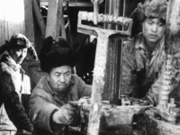

# 开始全面建设社会主义时期(1956.9—1966.4)

>
> 
>
> 1956年9月15日至27日，中国共产党第八次全国代表大会在北京举行。这次大会是在我国社会主义改造基本完成，党面临着新的形势和任务的情况下召开的。八大正确地分析了国内形势和国内主要矛盾的变化，提出了党在今后的根本任务，确定了以经济建设为中心的建设社会主义现代化国家的基本指导思想和路线。
> 
> [【更多】](./introduce.md)

- [中共中央、国务院关于加强农业生产合作社的生产领导和组织建设的指示](./article-1.md)
- [中国共产党第八次全国代表大会开幕词](./article-2.md)
- [在中国共产党第八次全国代表大会上的政治报告](./article-3.md)
- [关于修改党的章程的报告](./article-4.md)
- [关于发展国民经济的第二个五年计划的建议的报告](./article-5.md)
- [为中国人民解放军的现代化而斗争](./article-6.md)
- [正确处理积累和消费的比例关系](./article-7.md)
- [进一步加强人民民主法制，保障社会主义建设事业](./article-8.md)
- [社会主义改造基本完成以后的新问题](./article-9.md)
- [市场物价问题](./article-10.md)

**说明：**从此以后的文件网上只有扫描版，作者精力有限，无力整理，故只放标题。

- [为了社会主义建设，加强全国的计划工作](./article-11.md)
- [中国共产党章程](./article-12.md)
- [中国共产党第八次全国代表大会关于政治报告的决议](./article-13.md)
- [中共中央、国务院发送《国务院关于改进国家行政体制的决议（草案）》的通知](./article-14.md)
- [建设规模要和国力相适应](./article-15.md)
- [中央军委关于裁减军队数量加强质量的决定](./article-16.md)
- [中共中央批转中央组织部《关于县、区、乡的组织形式和领导方法的若干问题的报告》](./article-17.md)
- [中共中央关于一九五七年开展增产节约运动的指示](./article-18.md)
- [中共中央关于今后干部工作方法的通知](./article-19.md)
- [中共中央批发中央统战部《关于继续发挥工商业联合会的作用的意见》](./article-20.md)
- [如何处理人民内部的矛盾（讲话提纲）](./article-21.md)
- [关于正确处理人民内部矛盾的问题](./article-22.md)
- [最高国务会议第十一次（扩大）会议结束语提纲](./article-23.md)
- [粮食问题不可掉以轻心](./article-24.md)
- [在中国共产党全国宣传工作会议上的讲话](./article-25.md)
- [中共中央关于民主办社几个事项的通知](./article-26.md)
- [中共中央关于传达全国宣传工作会议的指示](./article-27.md)
- [坚持艰苦奋斗，密切联系群众](./article-28.md)
- [在军事检察院检察长、军事法院院长会议上的讲话](./article-29.md)
- [中共中央关于处理罢工、罢课问题的指示](./article-30.md)
- [在社会主义建设中，活一点有好处](./article-31.md)
- [中共中央关于研究有关工人阶级的几个重要问题的通知](./article-32.md)
- [今后的主要任务是搞建设](./article-33.md)
- [关于中小学毕业生参加农业生产问题](./article-34.md)
- [外出视察的报告](./article-35.md)
- [国务院关于消灭血吸虫病的指示](./article-36.md)
- [中国共产党中央委员会关于整风运动的指示](./article-37.md)
- [如何正确处理人民内部矛盾](./article-38.md)
- [中共中央关于继续组织党外人士对党政所犯错误缺点展开批评的指示](./article-39.md)
- [关于高级党校学员整风问题的谈话](./article-40.md)
- [中共中央关于各级领导人员参加体力劳动的指示](./article-41.md)
- [中共中央关于对待当前党外人士批评的指示](./article-42.md)
- [中共中央关于组织力量准备反击右派分子进攻的指示](./article-43.md)
- [中共中央批转李富春、薄一波《关于解决目前经济建设和文化建筑方面存在的一些问题的意见》](./article-44.md)
- [这是为什么？](./article-45.md)
- [不平常的春天](./article-46.md)
- [政府工作报告](./article-47.md)
- [中共中央关于在一两个月后吸收一批高级知识分子入党的通知](./article-48.md)
- [关于一九五六年国家决算和一九五七年国家预算草案的报告](./article-49.md)
- [关于一九五六年度国民经济计划的执行结果和一九五七年度国民经济计划草案的报告](./article-50.md)
- [军事建设概况](./article-51.md)
- [一九五七年夏季的形势](./article-52.md)
- [关于我国民族政策的几个问题](./article-53.md)
- [中共中央同意中央组织部、宣传部《关于为抽调干部加强大、中学校及科学研究机关的领导向中央的报告》](./article-54.md)
- [中共中央关于向全体农村人口进行一次大规模的社会主义教育的指示](./article-55.md)
- [国务院关于由国家计划收购（统购）和统一收购的农产品和其他物资不准进入自由市场的规定](./article-56.md)
- [中共中央批转中央手工业管理局、全国手工业合作总社筹委会党组《关于召开省、市、自治区手工业改造座谈会的报告》](./article-57.md)
- [中共中央关于整顿农业生产合作社的指示](./article-58.md)
- [中共中央关于做好农业合作社生产管理工作的指示](./article-59.md)

**说明：**由于WayBack Machine的爬虫问题，这一页的文件本来应该有5页，但它只爬取了第一页的文献列表，所以这里也只列举第一页。我会把原网站的存档链接和可能可以找到其它文献的参考链接放在这里，如果需要可以参考。

本部分内容大部分收录在以下文献中：