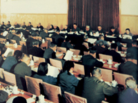

# 社会主义现代化建设新时期(1976.10—2006.3)

>
> 
>
> 十一届三中全会是建国以来党的历史上具有深远意义的伟大转折。这次全会彻底否定“两个凡是”的方针，重新确立解放思想、实事求是的指导思想，实现了思想路线的拨乱反正；停止使用“以阶级斗争为纲”的口号，作出工作重点转移的决策，实现了政治路线的拨乱反正。
> 
>  [【更多】](./introduce.md)

- [十一届三中全会以来文献选编](./11/README.md)
- [十二大以来文献选编](./12/README.md)
- [十三大以来文献选编](./13/README.md)
- [十四大以来文献选编](./14/README.md)
- [十五大以来文献选编](./15/README.md)
- [十六大以来文献选编](./16/README.md)
- [十七大以来文献选编](./17/README.md)

**说明：**由于WayBack Machine的爬虫问题，这一页的文章都没有被爬取到，因此只有标题。作者暂时没有时间整理，所以先这样放着。