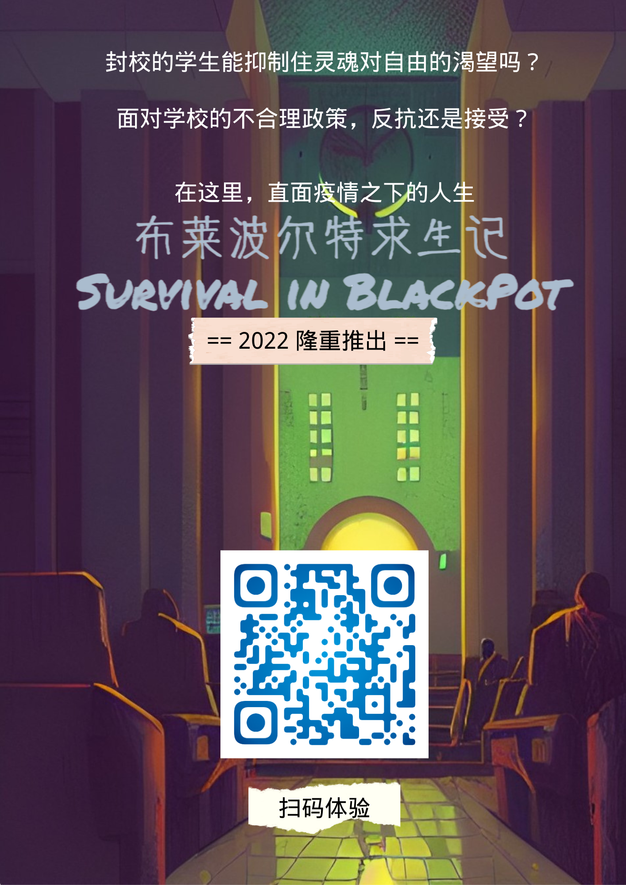

現実に捧げる壮大な叙事詩

ブラックポットアカデミーの閉鎖的な学校生活

ここでは、COVID-19のもとで生命と直接対峙しています

<b>2022、予約販売中</b>
  
  
<b><a href="https://hg.meo.ac.cn/" target=:"_blank">游玩Demo</a></b>

<svg xmlns="http://www.w3.org/2000/svg" class="icon icon-tabler icon-tabler-square-1" width="84" height="84" viewBox="0 0 24 24" stroke-width="1.5" stroke="#000000" fill="none" stroke-linecap="round" stroke-linejoin="round">
  <path stroke="none" d="M0 0h24v24H0z" fill="none"/>
  <path d="M12 16v-8l-2 2" />
  <rect x="4" y="4" width="16" height="16" rx="2" />
</svg>
<h3>缘起</h3>

疫情从各个方面深重的改变了我们的生活，也包括作者的大学生活。

按理来讲，配合学校的防疫工作是义务，但学校也曾出现过一些不合理的政策，比如突然封寝而不通知为什么。

曾经看到过[一篇文章](https://mp.weixin.qq.com/s/OnGnWCNjzqmKAPW41Wxg2Q)，讲网课一代的大学生活，读来感触颇深。不禁思考，记录这个时代，或许也是我们的义务之一。

因此，我选择制作这款游戏，想以黑锅大学为切入点，记录普通的大学生们在疫情当下的生活，塑造一些不那么“正确”，但有血有肉的集体记忆。

当然，你说这款游戏里完全没有我对学校政策的不满，那也是不可能的（笑）

但本意上来讲，作者无意针对学校，最多只是希望这款游戏能够对学校起到一个善意的提醒作用。

所以就请诸位看官且图一乐吧！

<svg xmlns="http://www.w3.org/2000/svg" class="icon icon-tabler icon-tabler-square-2" width="84" height="84" viewBox="0 0 24 24" stroke-width="1.5" stroke="#000000" fill="none" stroke-linecap="round" stroke-linejoin="round">
  <path stroke="none" d="M0 0h24v24H0z" fill="none"/>
  <path d="M10 10a2 2 0 1 1 4 0c0 .591 -.417 1.318 -.816 1.858l-3.184 4.143l4 0" />
  <rect x="4" y="4" width="16" height="16" rx="2" />
</svg>
<h3>简介</h3>

布莱波尔特（BlackPot Collage，亦称黑锅大学）是一个基于现实中存在的某所大学而虚构的院校。

《布莱波尔特求生记》是一款开发中的Web端互动文字游戏，在本作中，您可以全方位沉浸式的体验一名普通冤种大学生在黑锅大学的封校生活。

**面对学校的不合理政策政策，是默默忍受，还是勇于抗争？**

<svg xmlns="http://www.w3.org/2000/svg" class="icon icon-tabler icon-tabler-align-center" width="40" height="40" viewBox="0 0 24 24" stroke-width="1.5" stroke="#000000" fill="none" stroke-linecap="round" stroke-linejoin="round">
  <path stroke="none" d="M0 0h24v24H0z" fill="none"/>
  <line x1="4" y1="6" x2="20" y2="6" />
  <line x1="8" y1="12" x2="16" y2="12" />
  <line x1="6" y1="18" x2="18" y2="18" />
</svg>

**游戏特色**

【多国语言支持】

【Web游戏，全设备可玩】

【完全免费无广告】

【无比真实】

<svg xmlns="http://www.w3.org/2000/svg" class="icon icon-tabler icon-tabler-square-3" width="84" height="84" viewBox="0 0 24 24" stroke-width="1.5" stroke="#000000" fill="none" stroke-linecap="round" stroke-linejoin="round">
  <path stroke="none" d="M0 0h24v24H0z" fill="none"/>
  <path d="M12 12a2 2 0 1 0 -2 -2" />
  <path d="M10 14a2 2 0 1 0 2 -2" />
  <rect x="4" y="4" width="16" height="16" rx="2" />
</svg>
<h3>征集</h3>

欢迎各位玩家通过下列匿名表单提交游戏情节（如学校的不合理政策，或你对学校的诉求等），我们会酌情采用！

**该表单的填写过程是全程匿名的，无需登录，包括作者在内的任何人都无法知晓填写者，请放心填写！**

**为了保障您的信息安全，请务必从本页进入表单，防止信息被不怀好意的第三方收集！**

<svg xmlns="http://www.w3.org/2000/svg" class="icon icon-tabler icon-tabler-arrow-down-circle" width="40" height="40" viewBox="0 0 24 24" stroke-width="1.5" stroke="#000000" fill="none" stroke-linecap="round" stroke-linejoin="round">
  <path stroke="none" d="M0 0h24v24H0z" fill="none"/>
  <circle cx="12" cy="12" r="9" />
  <line x1="8" y1="12" x2="12" y2="16" />
  <line x1="12" y1="8" x2="12" y2="16" />
  <line x1="16" y1="12" x2="12" y2="16" />
</svg>

[按此填写内容征集表单](https://forms.office.com/r/2RMHfa0Pxc)

（微信、QQ用户亦可长按下方二维码，扫码填写！）

<svg xmlns="http://www.w3.org/2000/svg" class="icon icon-tabler icon-tabler-square-4" width="84" height="84" viewBox="0 0 24 24" stroke-width="1.5" stroke="#000000" fill="none" stroke-linecap="round" stroke-linejoin="round">
  <path stroke="none" d="M0 0h24v24H0z" fill="none"/>
  <path d="M13 16v-8l-4 6h5" />
  <rect x="4" y="4" width="16" height="16" rx="2" />
</svg>
<h3>分享</h3>

长按保存此海报即可分享本页

<svg xmlns="http://www.w3.org/2000/svg" class="icon icon-tabler icon-tabler-arrow-down-circle" width="40" height="40" viewBox="0 0 24 24" stroke-width="1.5" stroke="#000000" fill="none" stroke-linecap="round" stroke-linejoin="round">
  <path stroke="none" d="M0 0h24v24H0z" fill="none"/>
  <circle cx="12" cy="12" r="9" />
  <line x1="8" y1="12" x2="12" y2="16" />
  <line x1="12" y1="8" x2="12" y2="16" />
  <line x1="16" y1="12" x2="12" y2="16" />
</svg>

---

*本企划部分灵感来源于[东急求生记](https://mp.weixin.qq.com/s/ob71vLWxrVoD8dMb_Rrudw)*

&copy; [大冤种工作室](mailto:i@meo.ac.cn) 荣誉出品.
